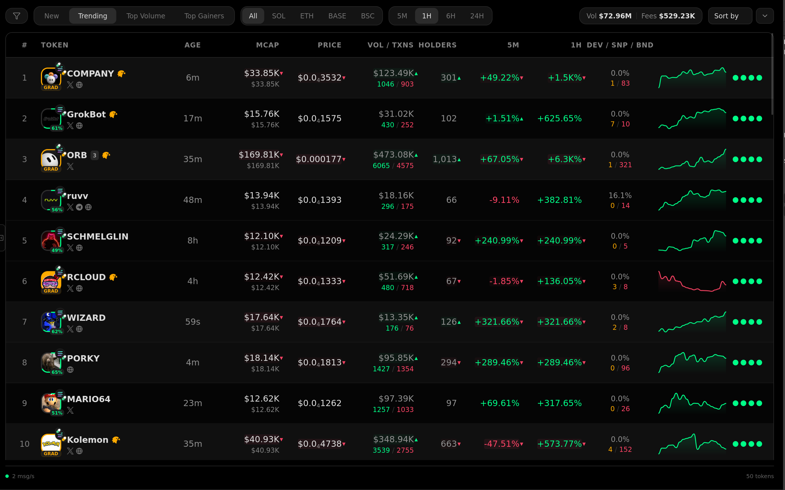
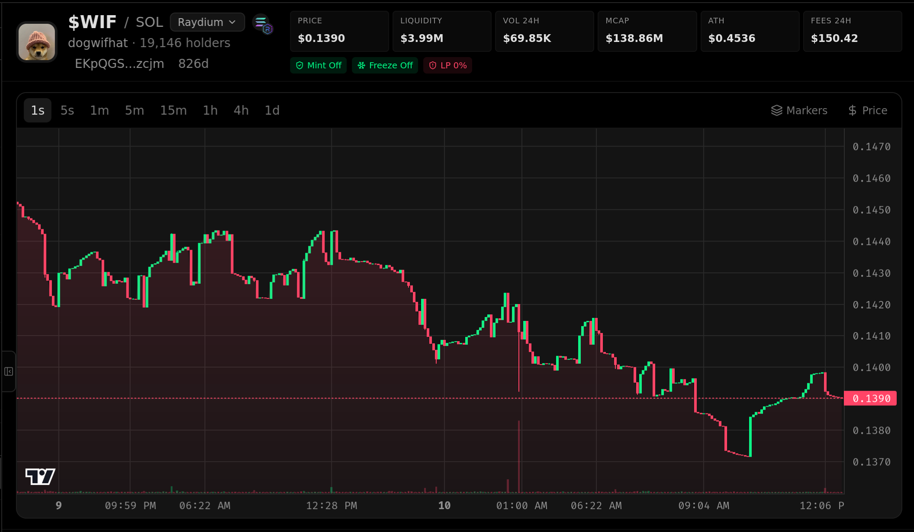
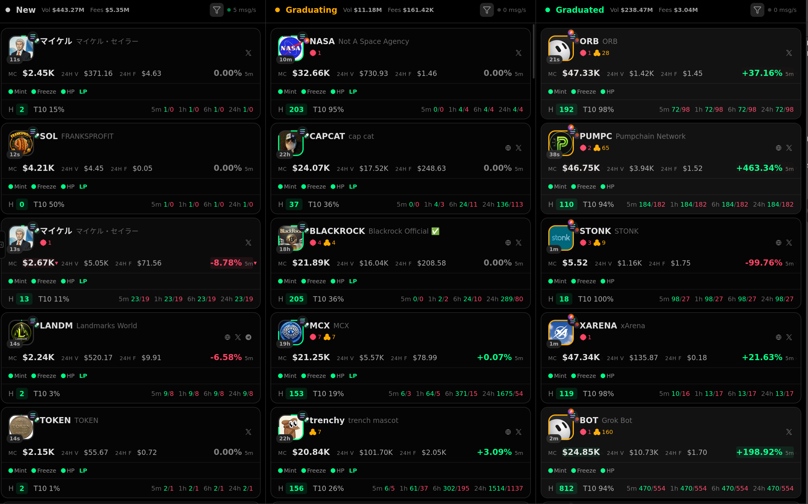
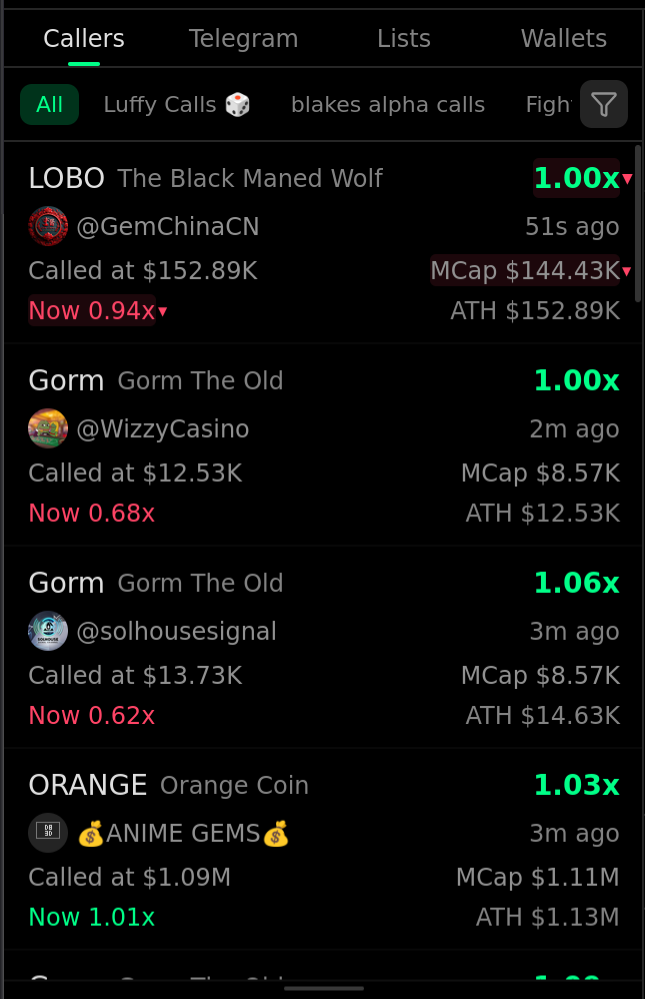
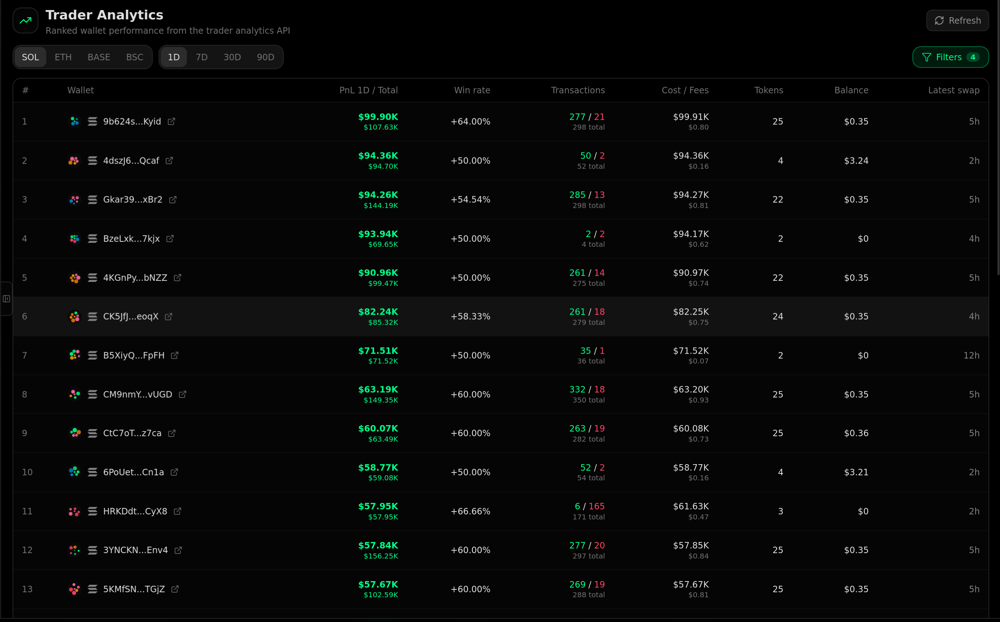
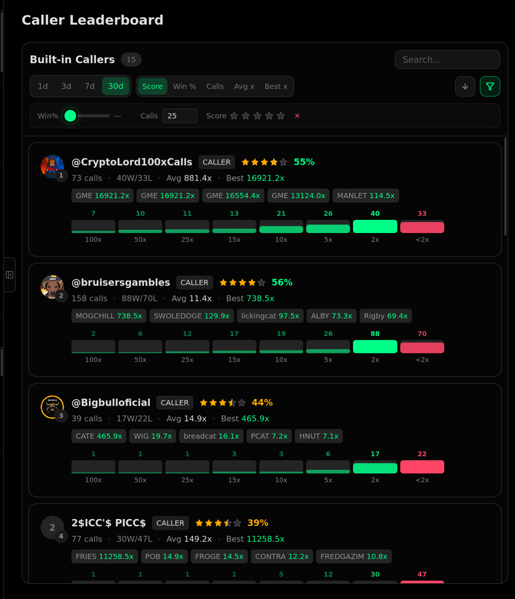
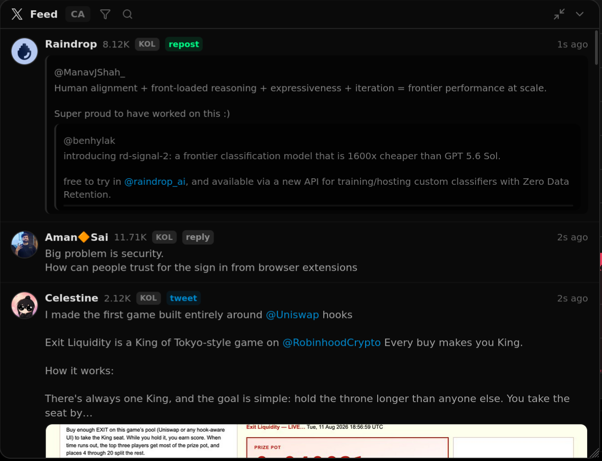

<div align="center">


# OMBRA

**A fully-featured, open-source crypto trading terminal — built on the [OpenDEX](https://opendex.ws) API.**

Scan, chart, trade, and track memecoins and DeFi tokens across **Solana · ETH · BASE · BSC** — with live WebSocket data end to end. Use it, improve it, or make it your own.

Svelte 5 · SvelteKit · Cloudflare Workers

</div>

---

Ombra is the open-source terminal running at [terminal.opendex.ws](https://terminal.opendex.ws/), built on the OpenDEX REST + WebSocket API. It is a real, production-grade trading UI with two goals: give you a complete foundation to fork and run as your own terminal, and give the community a direct way to improve the terminal everyone uses.

Fork it, theme it, extend it, connect it to your OpenDEX backend, and ship a terminal tailored to your product. Or improve Ombra itself: better controls in Trenches, different tab layouts, more show/hide options, faster rendering, or something we have not thought of yet. [Open a pull request](https://github.com/opendex-ws/ombra); if it is useful and preserves existing flows, we will merge it—and the improvement will go live for everyone on the hosted terminal.

We also want useful contributions to pay off for the people behind them, so contributors whose work improves Ombra may be rewarded with lower trading fees.

## Features

### Scanner
A high-throughput, virtual-scrolled token scanner with New / Trending / Top Volume / Top Gainers views, per-chain and per-timeframe filters, deep token filters, live sparklines, dev/sniper/bundler safety badges, and a live message-rate counter — all streaming over WebSockets.



### Token detail & live chart
TradingView-style candlestick charts with sub-second timeframes, live candle updates, ATH / take-profit price lines, and on-chart markers for KOL & dev swaps, calls, migrations, and your own trades. Header stats, holder distribution, safety audit, top traders, and a live swap feed round it out.



### Memescope
A three-lane bonding-curve tracker — **New → Graduating → Graduated** — with per-phase volume/fees, holder counts, safety flags, and live updates as tokens move through their lifecycle.



### Trading & positions
Buy/sell panels with presets, slippage/gas controls, take-profit & stop-loss targets, and a positions view for active trades, pending orders, and history — plus poppable floating trade windows and multi-tab tokens.

### Watchlist & caller feeds
Track callers, Telegram channels, saved lists, and wallets. A live feed shows who called what, the called-at market cap, current multiplier, and ATH.



### Trader analytics
Ranked wallet performance from the trader-analytics API — PnL, win rate, transactions, cost/fees, and holdings — with per-timeframe and per-chain filters, plus per-wallet drill-downs.



### Caller leaderboard & bots
Rank callers by score, win %, calls, and average/best multiplier with a multiplier-distribution breakdown, and configure copy-trade bots against your favorite sources.



### X / Twitter feed
A live, filterable X feed you can pin to a keyword — follow the narrative around any token or event in real time.



### And it's yours to change
- **Full theming system** — 40 CSS variables, dark/light, a live theme builder, and chat-style wallpapers.
- **Responsive** — desktop terminal and mobile bottom-sheet layouts.
- **Fast** — code-split, WebSocket-coalesced, CSS-contained high-churn lists.

## Getting started

**Prerequisites:** Node 18+, [pnpm](https://pnpm.io), and access to an OpenDEX backend.

```bash
pnpm install
cp .env.example .env      # set PUBLIC_API_BASE to your OpenDEX backend origin
pnpm dev
```

Set `PUBLIC_API_BASE` to your backend origin. By default the app calls it
**directly** (your backend must allow CORS). Alternatively, set `PUBLIC_API_PROXY=true`
to route through a **same-origin proxy** (the dev server and production Cloudflare
Worker forward all `/v2/*` requests — REST, token images, and the `/v2/ws` WebSocket —
to your backend, so no CORS is needed). See [`.env.example`](./.env.example).

| Task | Command |
|------|---------|
| Dev server | `pnpm dev` |
| Type check | `pnpm check` |
| Tests | `pnpm test` |
| Build | `pnpm build` |
| Deploy (Cloudflare) | `pnpm deploy:cf` |

Deploying to Cloudflare? Set `PUBLIC_API_BASE` in `wrangler.jsonc` (`vars`) or as a Worker variable, then `pnpm deploy:cf`.

## API types

Types in `src/lib/api/v2.d.ts` are generated from the backend's OpenAPI spec:

```bash
npx openapi-typescript <path-to>/opendex.v2.openapi.yaml -o src/lib/api/v2.d.ts
```

## Architecture

See [`AGENTS.md`](./AGENTS.md) for the full architecture, theming system, styling rules, and gotchas.

## License

[MIT](./LICENSE) — do whatever you want with it.
